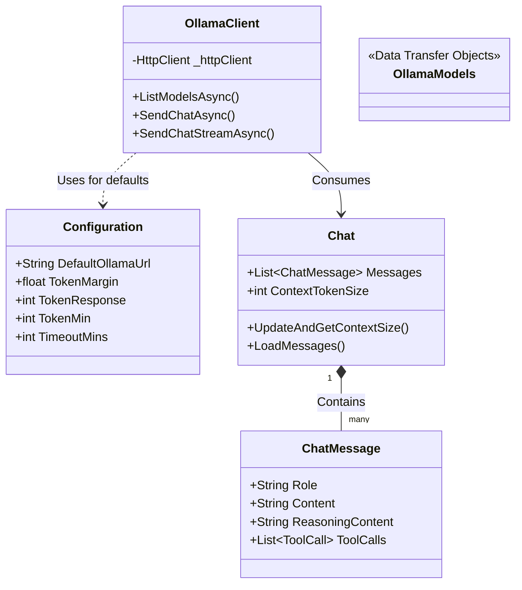

# Chatsito Core

## Overview

`chatsito.Core` is the foundational C# class library for the Chatsito project. It encapsulates the core data structures, configuration values, and the HTTP client logic required to interact with local Large Language Models (LLMs) via Ollama. By centralizing this logic, it ensures that both the web backend and any other potential C# consumers share a consistent, strongly-typed interface to the underlying AI models.

## Architecture & Logic

The project is designed to be lightweight and stateless where possible. The primary communication happens through `OllamaClient.cs`, which manages serialization, error handling, and streaming interactions with the Ollama REST API. 

The logic in this project primarily deals with:
- Formatting prompts and chat histories into Ollama-compatible requests.
- Parsing Ollama's JSON responses (and streaming JSON lines) back into C# objects.
- Managing context sizes and timeouts (configured via `Configuration.cs`).
- Providing clean exception handling for HTTP/network errors.

### Class Diagram

## Important Classes

- **`Configuration`**: A static class that holds application-wide defaults and tuning parameters, such as token limits (`TokenMin`, `TokenResponse`) and network timeouts (`TimeoutMins`).
- **`OllamaClient`**: The workhorse of the library. It manages the `HttpClient` lifecycle and exposes methods like `SendChatAsync` and `SendChatStreamAsync` to communicate with the Ollama daemon.
- **`Chat` & `ChatMessage`**: Represent the conversation state. `Chat` calculates the required context window size dynamically based on the conversation history length, ensuring Ollama allocates enough memory for the prompt.
- **`OllamaRequest` / `OllamaResponse`**: Internal Data Transfer Objects (DTOs) used to match Ollama's expected JSON payload structures exactly.
