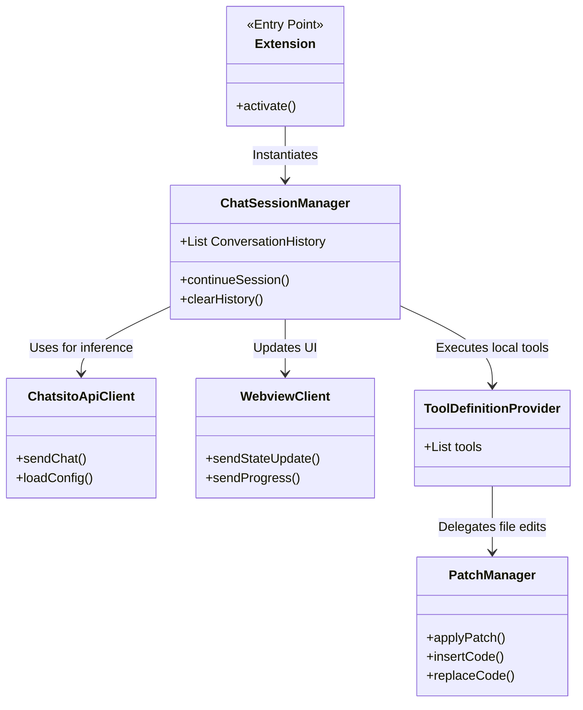

# Chatsito VS Code Extension

## Overview

`chatsito.VsCode` is the Visual Studio Code extension that brings the power of the Chatsito AI assistant directly into the developer's IDE. It provides a conversational interface inside a sidebar or panel, allowing the developer to ask questions, request code modifications, and execute complex workflows without leaving their editor.

Unlike the web interface, the VS Code extension runs locally within the IDE context, granting it secure access to the developer's workspace, active files, cursor positions, and diagnostic errors.

## Architecture & Logic

The extension is composed of several moving parts that communicate asynchronously:
1. **Extension Host (`extension.js`)**: The entry point. It registers commands (like opening the chat panel or running HumanEval) and instantiates the Webview providers.
2. **Webview UI (`webview.js` & `webviewApi.js`)**: The HTML/JS frontend that renders the chat interface inside VS Code. It uses VS Code's `postMessage` API to communicate with the extension host.
3. **Session Management (`ChatSessionManager.js`)**: The brain of the extension. It maintains the conversation history, intercepts the LLM's tool calls, executes them locally in the Node.js environment, and sends the results back to the LLM until a final response is ready.
4. **Tool Definitions (`ToolDefinitionProvider.js`)**: A massive registry of specific capabilities the LLM can use, such as reading files, finding references, modifying code (via `PatchManager.js`), and listing workspace files.
5. **API Client (`ChatsitoApiClient.js`)**: A lightweight HTTP client that forwards the final constructed prompts to the `chatsito.Web` backend for LLM inference.

### Class Diagram

## Important Classes

- **`ChatSessionManager`**: This is the orchestrator. When the user sends a message, it gathers the context (like the currently open file), appends it to the history, and queries the LLM via `ChatsitoApiClient`. If the LLM requests a tool call (e.g., "Read File X"), the manager intercepts it, executes the corresponding script from `tools/`, and feeds the output back into the loop.
- **`ChatsitoApiClient`**: Handles networking with the `chatsito.Web` backend. It dynamically loads configuration (like default models and timeouts) on initialization.
- **`WebviewClient`**: An abstraction wrapper around VS Code's Webview `postMessage` API. It standardizes how progress updates, errors, and state changes are streamed to the HTML UI.
- **`PatchManager`**: A critical security and safety class. It applies non-destructive edits using VS Code's `WorkspaceEdit` API, ensuring that file modifications are safely added to the editor's undo stack and correctly formatted.
