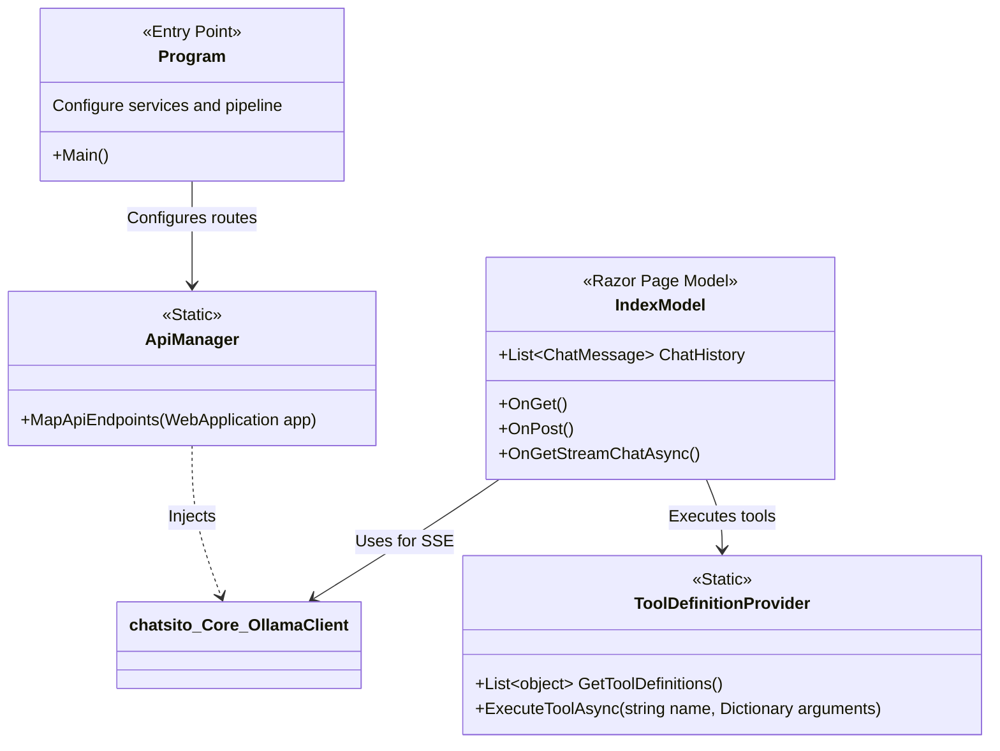

# Chatsito Web

## Overview

`chatsito.Web` is an ASP.NET Core web application that serves as the backend API and standalone web UI for the Chatsito ecosystem. It acts as a middle-tier proxy between front-end clients (such as the VS Code extension or the browser) and the underlying Ollama LLM service managed by `chatsito.Core`. 

By centralizing the API, it ensures that all clients share the same tool definitions, logic routing, and configuration parameters. It also hosts Razor Pages to provide a rich, interactive web-based chat experience directly in the browser.

## Architecture & Logic

The project follows a standard ASP.NET Core pattern:
1. **API Endpoints**: Defined in `ApiManager.cs`, these endpoints (`/api/chat`, `/api/config`, `/api/models`) handle incoming POST/GET requests. They deserialize payloads, invoke the `ModelClient` from `chatsito.Core`, and return results as JSON.
2. **Tool Provisioning**: The `ToolDefinitionProvider.cs` is responsible for defining the schemas and execution logic of the tools the LLM can invoke (e.g., executing an HTTP request or searching the web).
3. **Web UI**: Built using Razor Pages (`Pages/Index.cshtml` and `Index.cshtml.cs`). The UI connects to the server and uses Server-Sent Events (SSE) to stream back the LLM's thought processes and final responses in real-time.

### Class Diagram

## Important Classes

- **`ApiManager`**: Registers minimal APIs required for remote clients (like the VS Code extension) to fetch configurations and send non-streaming chat requests.
- **`ToolDefinitionProvider`**: A crucial class that maps JSON Schema tool definitions (which are sent to the LLM) to actual executable C# methods. For example, when the LLM decides to search the web, this class parses the arguments and performs the actual HTTP requests to scrape Google.
- **`IndexModel` (`Pages/Index.cshtml.cs`)**: The code-behind for the web UI. It implements the complex Server-Sent Events (SSE) logic to stream chunks of text back to the browser as the LLM generates them, providing a typing-effect user experience. It also handles the loop of providing tool execution results back to the LLM until a final answer is produced.
