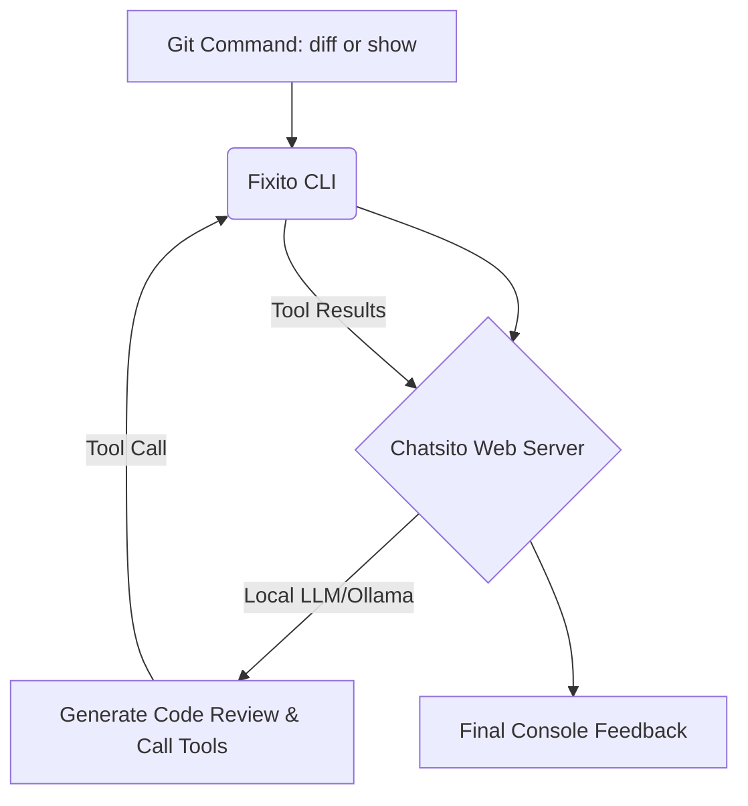

# Fixito: Autonomous CLI Code Review Assistant

**Fixito** is a standalone, lightweight, CLI-based code review tool designed to analyze Git diffs and commits. It connects to a local LLM (Large Language Model) server to review changes, detect potential runtime bugs, identify logical vulnerabilities, and suggest architectural improvements.

Unlike cloud-based review tools, **Fixito** is built for developer privacy, keeping all code analysis strictly within your local environment.

---

## Key Features

- **Git Integration**: Accepts commands like `git diff` (to check the current working branch changes) or `git show <commit-hash>` (to check a specific historical commit).
- **Interactive Tool Execution**: Built on a complete Node.js ESM execution loop, allowing the underlying LLM to autonomously trigger diagnostic tools (such as reading files, searching symbols, or analyzing call trees) to gain full context of changes before giving a final review.
- **Aesthetic Console Output**: Logs step-by-step progress showing when the assistant is collecting workspace context, thinking, or invoking specific tools.

---

## How It Works

Fixito acts as a CLI bridge between Git and a running **Chatsito** LLM server.



This project relies on the **chatsito.web** project as a server to interact with local LLM providers (e.g. Ollama). For more details on the main engine and server setup, refer to the [Chatsito README](../chatsito/README.md).

---

## Why Is It Useful?

1. **Maximum Privacy**: Because it connects to a local Chatsito server running LLMs locally, no source code is uploaded to the internet or shared with third parties.
2. **Contextual Intelligence**: Traditional linters only check syntax and basic rules. Fixito uses an LLM that reads adjacent file contents, workspace structures, and declaration trees to understand *what* the code is doing.
3. **Pre-Commit Guardrail**: Catch off-by-one errors, missing exports, configuration typos, or formatting errors *before* the code gets merged into your main branch.

---

## Workflow Integration & Automation

### 1. Git Pre-Commit Hook (Local Automation)
You can automate Fixito to inspect code changes every time you run `git commit`. 

Create or edit `.git/hooks/pre-commit` in your repository:
```bash
#!/bin/sh
# Run Fixito to review current staged diffs
node d:/Development/GitHub/MachineLarning/Fixito/index.js "git diff"

# You can choose to block commit if necessary, or just display the warning
exit 0
```
Make the script executable:
```bash
chmod +x .git/hooks/pre-commit
```

### 2. CI/CD Integration (GitHub Actions)
You can set up a GitHub Actions workflow to run Fixito on every Pull Request or commit push.

Add the following to `.github/workflows/fixito-review.yml`:
```yaml
name: Fixito Code Review

on:
  pull_request:
    branches: [ main ]

jobs:
  review:
    runs-on: self-hosted # Requires a runner with access to the local Chatsito/Ollama server
    steps:
      - name: Checkout Code
        uses: actions/checkout@v4
        with:
          fetch-depth: 0

      - name: Setup Node.js
        uses: actions/setup-node@v4
        with:
          node-version: '20'

      - name: Install Dependencies
        run: |
          cd Fixito
          npm install

      - name: Run Code Review
        run: |
          # Fetch the diff between the branch and main, then review it
          git diff origin/main...HEAD > pr.diff
          node Fixito/index.js "git diff" --url "http://localhost:5257"
```

### 3. Editor Task Integration (VS Code Tasks)
If you prefer triggering reviews manually via a keybinding in VS Code, you can define a custom workspace task:

Add this to your `.vscode/tasks.json`:
```json
{
  "version": "2.0.0",
  "tasks": [
    {
      "label": "Fixito: Review Git Diff",
      "type": "shell",
      "command": "node d:/Development/GitHub/MachineLarning/Fixito/index.js 'git diff'",
      "problemMatcher": [],
      "group": {
        "kind": "test",
        "isDefault": true
      }
    }
  ]
}
```

---

## Getting Started

1. **Start the Server**: Ensure the `chatsito.web` server is running locally (by default at `http://localhost:5257`).
2. **Install Dependencies**:
   ```bash
   cd Fixito
   npm install
   ```
3. **Execute**:
   ```bash
   # Review working directory changes
   node index.js "git diff"

   # Review a specific historical commit
   node index.js "git show faf005322b"
   ```
